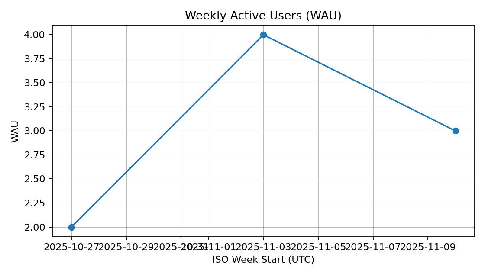
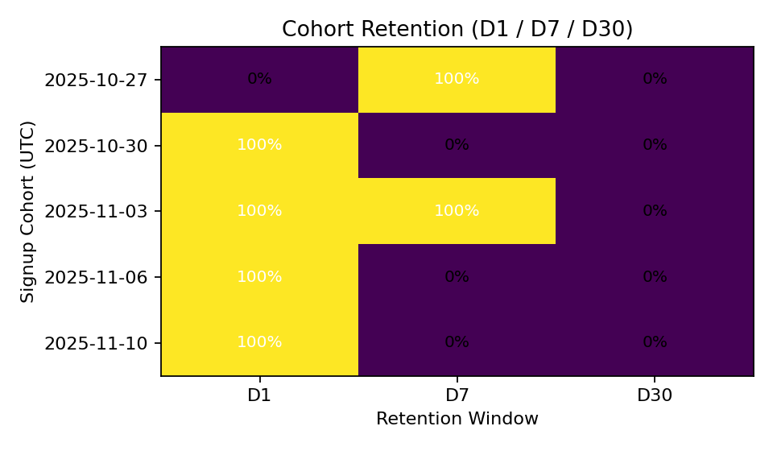
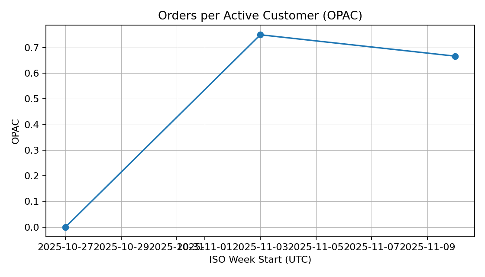

# BeamCart — Churn & North-Star Metrics Playbook

Goal: Define a clear North-Star metric and a churn/retention framework for a simple commerce app, compute them end-to-end (pandas + DuckDB), and publish a short decision memo.

Status: Day 1 — setup


## Day 1 — Acceptance
- ✅ Repo scaffolded
- ✅ Minimal metrics definitions doc
- ✅ Seeded synthetic data
- ✅ WAU/MAU/AOV computed (pandas) + WAU chart at docs/charts/wau_trend.png
- ✅ WAU & AOV parity with DuckDB SQL

## How to run (local)
**Prereqs:** Python 3.11+ (or 3.10/3.12/3.13), macOS/Linux

```bash
# 1) create & activate venv (first time)
python3 -m venv .venv
source .venv/bin/activate
python -m ensurepip --upgrade
python -m pip install --upgrade pip setuptools wheel
python -m pip install pandas duckdb pyarrow matplotlib

# 2) run the end-to-end pipeline
python scripts/run_pipeline.py

## How to run (local)
Prereqs: Python 3.11+ (or 3.10/3.12/3.13), macOS/Linux

1) Create & activate venv (first time):
   python3 -m venv .venv
   source .venv/bin/activate
   python -m ensurepip --upgrade
   python -m pip install --upgrade pip setuptools wheel
   python -m pip install pandas duckdb pyarrow matplotlib

2) Run the end-to-end pipeline:
   python scripts/run_pipeline.py

Outputs:
- CSVs in data/interim/ (e.g., wau_by_week.csv, weekly_kpis.csv)
- Charts in docs/charts/ (wau_trend.png, cohort_heatmap.png, opac_trend.png, etc.)

Notes:
- Timezone is UTC; ISO week starts Monday.
- Revenue/AOV/OPAC are net of refunds.
- Parity checks confirm pandas ↔ DuckDB SQL results match.

### Install via requirements.txt
```bash
python -m pip install -r requirements.txt
## Releases
- v0.1 — Day 1–3 MVP (metrics + SQL parity + charts + memo)
# BeamCart — Churn & North-Star Metrics Playbook
[](../../actions)

**What this is (1-liner):** A production-style growth metrics repo (DuckDB + pandas) with SQL↔Python parity, cohort retention, churn, and a decision memo centered on OPAC as the North-Star.

**What this shows (4+ YOE signals):**
- Metric governance (YAML → generated docs), clean definitions, UTC/ISO windows
- SQL↔pandas parity gates (fail CI on mismatch)
- Guardrails & monitoring (refund-rate alert, WAU control chart)
- Experiment-readiness (power calc + CUPED option)
- Reproducible pipeline, tests, Makefile, pre-commit

**Quick links**
- 📄 [Decision memo](docs/decision_memo.md)
- 📚 [Metrics definitions](docs/metrics_definitions.md)
- 🧪 `make ci-local` → runs pipeline + tests like CI

**Highlights**
<p float="left">
  
  
  
</p>

**Live site:** https://samuelvurity.github.io/beamcart-churn-metrics/
